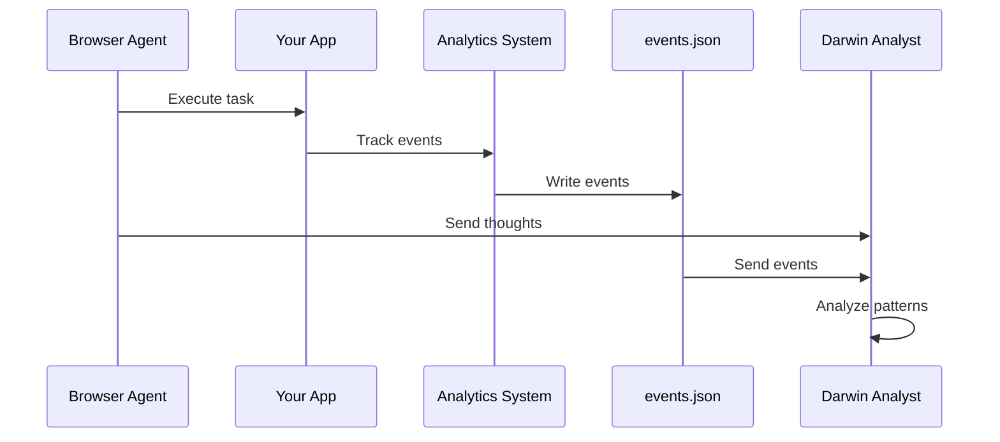

## Overview

Analytics tracking is a crucial part of Darwin's evolution pipeline. By monitoring user interactions, Darwin's AI can identify UX problems and generate targeted improvements.

<Info>
Darwin doesn't include built-in analytics. Instead, it integrates with **your existing analytics** implementation.
</Info>

## How It Works



<Steps>
  <Step title="Agent injects task context">
    The browser agent stores the task name in localStorage so your analytics can tag events
  </Step>

  <Step title="App tracks interactions">
    Your application fires analytics events during user interactions
  </Step>

  <Step title="Events are stored">
    Analytics events are saved to `events.json` (or your preferred storage)
  </Step>

  <Step title="Analyst consumes data">
    Darwin's Analyst reads events and correlates with agent thoughts
  </Step>
</Steps>

## Task Context Injection

Before executing, the browser agent injects task information:

```typescript
// In browser-agent.ts
await page.evaluate((task: string) => {
  if (typeof window !== 'undefined') {
    // Store in localStorage
    localStorage.setItem('darwin_task', task);
    // Also set on window for immediate access
    (window as any).__darwinTask = task;
  }
}, taskForAnalytics);
```

Your analytics can then access this:

```typescript
// In your app's analytics
const currentTask = localStorage.getItem('darwin_task');

trackEvent('button_click', {
  button_text: 'Sign Up',
  page_name: window.location.pathname,
  task: currentTask  // Tag with Darwin task
});
```

## Event Types

### Recommended Events

For best results, track these event types:

<Tabs>
  <Tab title="Session Events">
    **Track the lifecycle of a user session**

    ```typescript
    // When agent starts
    {
      event: 'session_started',
      session_id: generateSessionId(),
      user_id: generateUserId(),
      timestamp: Date.now(),
      task: localStorage.getItem('darwin_task')
    }

    // When agent completes
    {
      event: 'session_ended',
      session_id: currentSessionId,
      user_id: currentUserId,
      timestamp: Date.now(),
      session_duration: elapsedMs,
      task: localStorage.getItem('darwin_task')
    }
    ```
  </Tab>

  <Tab title="Interaction Events">
    **Track user actions**

    ```typescript
    {
      event: 'button_click',
      session_id: currentSessionId,
      user_id: currentUserId,
      timestamp: Date.now(),
      properties: {
        button_text: 'Sign Up',
        button_id: 'signup-btn',
        page_name: '/'
      }
    }

    {
      event: 'form_submit',
      session_id: currentSessionId,
      properties: {
        form_id: 'signup-form',
        field_count: 3,
        page_name: '/signup'
      }
    }
    ```
  </Tab>

  <Tab title="Navigation Events">
    **Track page views and scrolling**

    ```typescript
    {
      event: 'page_view',
      session_id: currentSessionId,
      timestamp: Date.now(),
      properties: {
        page_name: '/products',
        referrer: document.referrer
      }
    }

    {
      event: 'scroll',
      properties: {
        scroll_depth: 75,  // percentage
        page_name: '/'
      }
    }
    ```
  </Tab>

  <Tab title="Error Events">
    **Track problems users encounter**

    ```typescript
    {
      event: 'error_shown',
      session_id: currentSessionId,
      timestamp: Date.now(),
      properties: {
        error_type: 'validation',
        error_message: 'Email is required',
        field_name: 'email',
        page_name: '/signup'
      }
    }
    ```
  </Tab>
</Tabs>

## Implementation Example

Here's how the demo app implements analytics:

### 1. Analytics Context

```typescript
// lib/analytics-context.tsx
import { createContext, useContext, useEffect } from 'react';

interface AnalyticsContextType {
  trackEvent: (event: string, properties?: Record<string, any>) => void;
  sessionId: string;
  userId: string;
}

const AnalyticsContext = createContext<AnalyticsContextType | null>(null);

export function AnalyticsProvider({ children }: { children: React.ReactNode }) {
  // Generate IDs on mount
  const sessionId = sessionStorage.getItem('analytics_session_id') || generateId();
  const userId = localStorage.getItem('analytics_user_id') || generateId();

  useEffect(() => {
    sessionStorage.setItem('analytics_session_id', sessionId);
    localStorage.setItem('analytics_user_id', userId);

    // Track session start
    trackEvent('session_started', {
      task: localStorage.getItem('darwin_task')
    });
  }, []);

  const trackEvent = async (event: string, properties?: Record<string, any>) => {
    const payload = {
      event,
      session_id: sessionId,
      user_id: userId,
      timestamp: Date.now(),
      ...properties
    };

    // Send to backend
    await fetch('/api/events', {
      method: 'POST',
      headers: { 'Content-Type': 'application/json' },
      body: JSON.stringify(payload)
    });
  };

  return (
    <AnalyticsContext.Provider value={{ trackEvent, sessionId, userId }}>
      {children}
    </AnalyticsContext.Provider>
  );
}

export const useAnalytics = () => useContext(AnalyticsContext)!;
```

### 2. Track Button Clicks

```typescript
// components/Button.tsx
import { useAnalytics } from '@/lib/analytics-context';

export function Button({ children, onClick, ...props }) {
  const { trackEvent } = useAnalytics();

  const handleClick = (e) => {
    trackEvent('button_click', {
      button_text: children,
      page_name: window.location.pathname
    });
    onClick?.(e);
  };

  return (
    <button onClick={handleClick} {...props}>
      {children}
    </button>
  );
}
```

### 3. Backend Storage

```typescript
// app/api/events/route.ts
import { NextResponse } from 'next/server';
import fs from 'fs';
import path from 'path';

const EVENTS_FILE = path.join(process.cwd(), 'events.json');

export async function POST(request: Request) {
  const event = await request.json();

  // Read existing events
  let events = [];
  if (fs.existsSync(EVENTS_FILE)) {
    const content = fs.readFileSync(EVENTS_FILE, 'utf-8');
    events = JSON.parse(content);
  }

  // Append new event
  events.push(event);

  // Write back
  fs.writeFileSync(EVENTS_FILE, JSON.stringify(events, null, 2));

  return NextResponse.json({ success: true });
}
```

## Visual Overlays

Darwin shows analytics events visually in the browser:

### Analytics Overlay

When an event is tracked, a toast notification appears:

```typescript
// Injected by browser-agent.ts
await injectAnalyticsOverlay(page);
```

The overlay listens for events:

```typescript
// In analytics-overlay.ts
window.addEventListener('darwin:analytics:event', (e) => {
  const { event, properties } = e.detail;
  showToast(`Event: ${event}`, properties);
});
```

Your app should dispatch these events:

```typescript
// In your analytics tracking code
window.dispatchEvent(new CustomEvent('darwin:analytics:event', {
  detail: { event: 'button_click', properties: {...} }
}));
```

## Data Schema

### Event Format

```typescript
interface AnalyticsEvent {
  event: string;              // Event name
  session_id: string;         // Unique session identifier
  user_id: string;            // Unique user identifier
  timestamp: number;          // Unix timestamp in ms
  task?: string;              // Darwin task (if applicable)
  task_name?: string;         // Human-readable task name
  page_name?: string;         // Current page/route
  properties?: Record<string, any>;  // Additional data
}
```

### Snapshot Format

```typescript
interface AnalyticsSnapshot {
  events: AnalyticsEvent[];
}
```

This is what the Analyst receives.

## Session Management

### Session IDs

Use `sessionStorage` for temporary session IDs:

```typescript
const sessionId = sessionStorage.getItem('analytics_session_id') || 
                  generateSessionId();
sessionStorage.setItem('analytics_session_id', sessionId);
```

### User IDs

Use `localStorage` for persistent user IDs:

```typescript
const userId = localStorage.getItem('analytics_user_id') || 
               generateUserId();
localStorage.setItem('analytics_user_id', userId);
```

### ID Generation

```typescript
function generateSessionId(): string {
  return `sess_${Date.now()}_${Math.random().toString(36).substr(2, 9)}`;
}

function generateUserId(): string {
  return `user_${Math.random().toString(36).substr(2, 9)}`;
}
```

## Best Practices

<CardGroup cols={2}>
  <Card title="Tag with Tasks" icon="tag">
    Always include the Darwin task in your events for better correlation
  </Card>
  <Card title="Include Context" icon="info">
    Add page_name, button_text, and other context to help analysis
  </Card>
  <Card title="Track Errors" icon="triangle-exclamation">
    Validation errors and failures are valuable for UX analysis
  </Card>
  <Card title="Consistent Schema" icon="table">
    Use the same event format across your app
  </Card>
</CardGroup>

### What to Track

<Tip>
Track **intent and friction**, not just actions:

- How long before users find buttons?
- Do they click the wrong thing first?
- Are validation errors shown?
- Do they abandon forms?
</Tip>

## Integration with Third-Party Analytics

You can use existing analytics platforms:

### Amplitude

```typescript
import * as amplitude from '@amplitude/analytics-browser';

amplitude.init('YOUR_API_KEY');

function trackEvent(event: string, properties?: Record<string, any>) {
  amplitude.track(event, {
    ...properties,
    darwin_task: localStorage.getItem('darwin_task')
  });

  // Also save locally for Darwin
  saveToEventsJson({ event, ...properties });
}
```

### Mixpanel

```typescript
import mixpanel from 'mixpanel-browser';

mixpanel.init('YOUR_TOKEN');

function trackEvent(event: string, properties?: Record<string, any>) {
  mixpanel.track(event, {
    ...properties,
    darwin_task: localStorage.getItem('darwin_task')
  });

  // Also save locally
  saveToEventsJson({ event, ...properties });
}
```

<Note>
Darwin needs local access to events, so you'll need to duplicate events to `events.json` or export from your analytics platform.
</Note>

## Troubleshooting

### Events not captured

- Check that `trackEvent` is being called
- Verify `/api/events` endpoint is working
- Confirm `events.json` is being written

### Analysis missing context

- Ensure events include `session_id` for grouping
- Add `page_name` to all events
- Tag events with the Darwin task

### Overlays not showing

- Confirm you're dispatching `darwin:analytics:event`
- Check browser console for errors
- Verify overlay injection succeeded

## Next Steps

<CardGroup cols={2}>
  <Card title="Evolution Pipeline" icon="dna" href="/concepts/evolution-pipeline">
    Learn how analytics feed into code evolution
  </Card>
  <Card title="Browser Agent" icon="robot" href="/concepts/browser-agent">
    Understand how the agent captures thoughts
  </Card>
  <Card title="Dashboard" icon="desktop" href="/guides/dashboard">
    Monitor analytics visually
  </Card>
  <Card title="Examples" icon="lightbulb" href="/examples/ui-evolution">
    See analytics-driven evolution in action
  </Card>
</CardGroup>