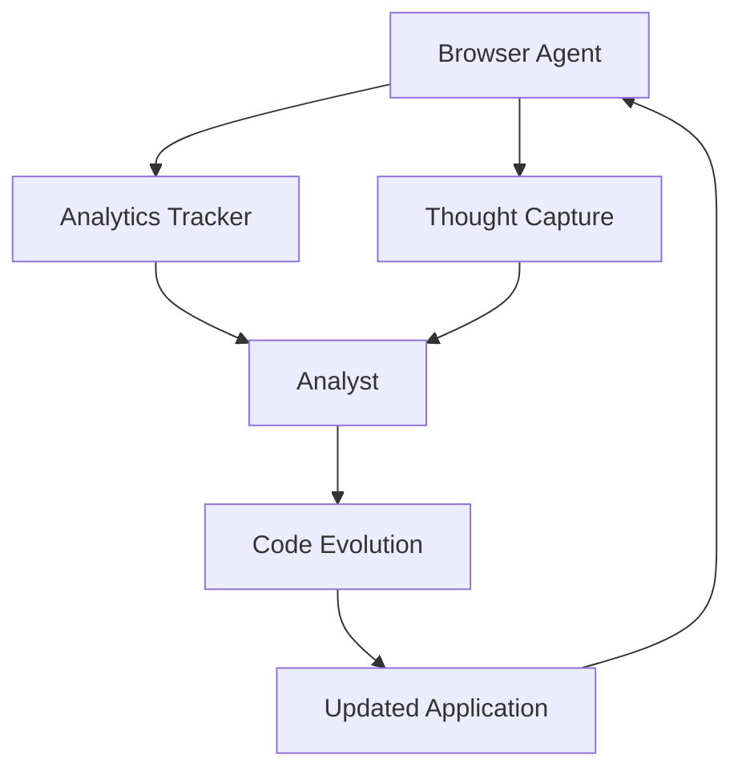
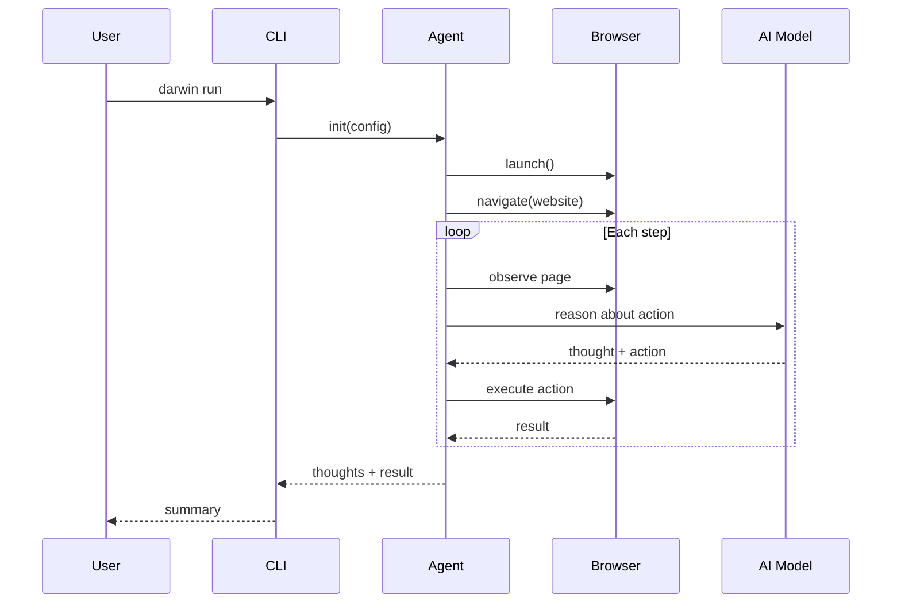
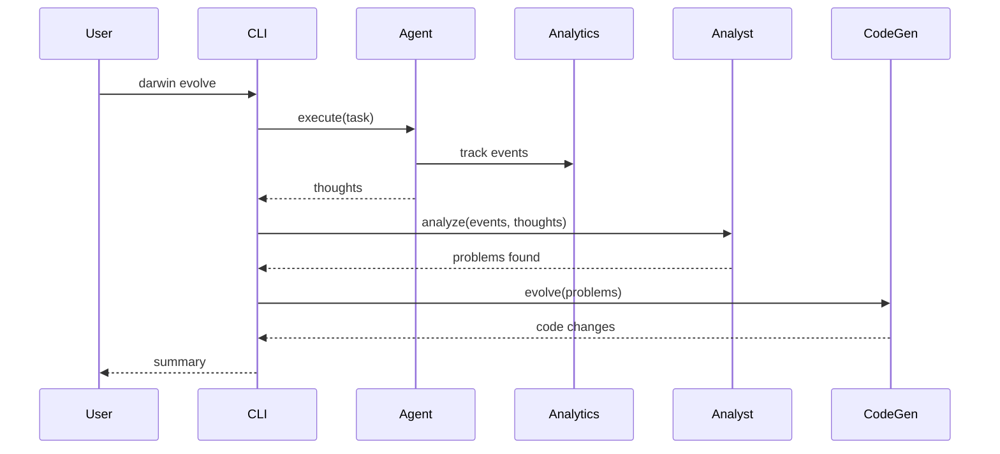

## System Overview

Darwin is built as a modular system with four main components:



<CardGroup cols={2}>
  <Card title="Browser Agent" icon="robot">
    AI-powered browser automation with hybrid DOM and coordinate-based actions
  </Card>
  <Card title="Analytics Tracker" icon="chart-line">
    Captures user interactions, events, and behavioral data
  </Card>
  <Card title="Analyst" icon="brain">
    AI analyzer that identifies patterns and UX issues from data
  </Card>
  <Card title="Code Evolution" icon="code">
    Generates code changes to fix identified problems
  </Card>
</CardGroup>

## Component Details

### BrowserAgent Class

**Location**: `packages/darwin-sdk/core/browser-agent.ts`

The core automation engine that wraps Stagehand V3:

```typescript
export interface BrowserAgentConfig {
  website: string;
  task: string;
  taskName?: string;
  model?: string;
  maxSteps?: number;
  env?: "LOCAL" | "BROWSERBASE";
  verbose?: 0 | 1 | 2;
  systemPrompt?: string;
  onEvent?: (type: "think" | "action" | "status" | "error", data: any) => void;
}
```

**Key Features**:

- **Hybrid Mode**: Combines DOM selectors with coordinate-based vision
- **Streaming**: Real-time output of reasoning and actions
- **Visual Overlays**: Timer, analytics, and reasoning displays
- **Thought Capture**: Records every decision the agent makes

**Lifecycle**:

<Steps>
  <Step title="Initialization">
    ```typescript
    const agent = new BrowserAgent(config);
    await agent.init();
    ```

    Creates Stagehand instance with hybrid mode enabled
  </Step>

  <Step title="Execution">
    ```typescript
    const { thoughts, result, steps } = await agent.execute();
    ```

    Runs the task with streaming output and thought capture
  </Step>

  <Step title="Cleanup">
    ```typescript
    await agent.close();
    ```

    Sends session_ended event and closes browser
  </Step>
</Steps>

### Analyst Class

**Location**: `packages/darwin-sdk/core/analyst.ts`

AI-powered analysis engine using Google Gemini:

```typescript
export class Analyst {
  constructor(targetAppPath?: string);
  
  async analyze(
    analytics: AnalyticsSnapshot,
    logic: ThoughtEntry[]
  ): Promise<AnalysisResult>;
  
  async evolve(
    analysis: AnalysisResult,
    onStream?: (data: string, type: 'stdout' | 'stderr') => void
  ): Promise<{ stdout: string; stderr: string; changes: any[] }>;
}
```

**Analysis Process**:

1. **Data Collection**: Receives analytics events and thought entries
2. **Pattern Recognition**: Uses Gemini to identify UX problems
3. **Problem Prioritization**: Ranks issues by severity and evidence
4. **Recommendation**: Suggests specific code changes

**Output Format**:

```typescript
interface AnalysisResult {
  summary: string;
  mainProblems: Array<{
    id: string;
    severity: "low" | "medium" | "high" | "critical";
    evidence: string[];
    hypothesis: string;
    recommendedAction: string;
    affectedArea: string;
  }>;
  confidence: number;
}
```

### Configuration System

**Location**: `packages/darwin-sdk/core/config.ts`

Manages `darwin.config.json` files:

```typescript
export interface DarwinConfig {
  website: string;
  task: string;
  model?: string;
  maxSteps?: number;
  env?: "LOCAL" | "BROWSERBASE";
  verbose?: 0 | 1 | 2;
  systemPrompt?: string;
}
```

**Functions**:

- `loadConfig(path?)` - Load from JSON file
- `saveConfig(config, path?)` - Save to JSON file
- `createDefaultConfig(path?)` - Create template
- `toBrowserAgentConfig(config)` - Convert to agent format

### API Server

**Location**: `packages/darwin-sdk/core/main.ts`

Express server providing HTTP endpoints:

```typescript
export function startDarwin(): void;
```

**Endpoints**:

| Endpoint | Method | Description |
|----------|--------|-------------|
| `/api/status` | GET | Check API health |
| `/api/config` | GET | Get current config |
| `/api/run` | POST | Start agent (async) |
| `/api/run-sync` | POST | Run agent (sync) |
| `/api/evolve` | POST | Full evolution pipeline |
| `/api/session/:id` | GET | Get session details |
| `/api/stream/:id` | GET | Stream session logs (SSE) |
| `/api/sessions` | GET | List all sessions |
| `/api/metrics` | GET | System metrics |

### Session Manager

**Location**: `packages/darwin-sdk/core/agent-sessions.ts`

Tracks running agents and their state:

```typescript
interface AgentSession {
  id: string;
  status: "initializing" | "running" | "completed" | "error";
  config: BrowserAgentConfig;
  logs: LogEntry[];
  result?: any;
  error?: string;
  createdAt: Date;
  completedAt?: Date;
  steps?: number;
  isEvolution?: boolean;
  changes?: any[];
}
```

**Event System**:

- `session:log` - New log entry
- `session:status` - Status change
- `session:completed` - Task finished
- `session:error` - Error occurred
- `session:changes` - Code changes generated

## Data Flow

### Standard Automation Flow



### Evolution Pipeline Flow



## Visual Overlays

Darwin injects JavaScript overlays into the browser for real-time feedback:

### Timer Overlay

**Location**: `packages/darwin-sdk/core/timer-overlay.ts`

- Shows elapsed time in top-left corner
- Starts automatically on page load
- Stops when task completes

### Analytics Overlay

**Location**: `packages/darwin-sdk/core/analytics-overlay.ts`

- Displays toast notifications when events are tracked
- Shows event type and details
- Auto-dismisses after a few seconds

### Reasoning Overlay

**Location**: `packages/darwin-sdk/core/reasoning-overlay.ts`

- Shows agent's current thought as subtitle at bottom
- Updates in real-time as agent thinks
- Clears when task completes

<Note>
All overlays are injected via `page.evaluate()` and use absolute positioning to avoid interfering with the page layout.
</Note>

## Dependencies

### Core Libraries

- **@browserbasehq/stagehand** - Browser automation framework
- **@google/genai** - Google Gemini SDK for AI
- **playwright** - Browser control (used by Stagehand)
- **express** - HTTP server
- **commander** - CLI framework

### AI Model SDKs

- **@google/genai** - For Gemini models
- **openai** - For OpenAI models (via Stagehand)
- **@anthropic-ai/sdk** - For Claude models (via Stagehand)

## Performance Considerations

<Warning>
The agent's speed depends on the AI model's response time. Gemini Flash 3 is recommended for best latency.
</Warning>

### Optimization Tips

1. **Use lower `maxSteps`** for faster iterations
2. **Set `verbose: 0`** to reduce logging overhead
3. **Use `env: "BROWSERBASE"`** for remote execution (no local browser)
4. **Increase model concurrency** in Stagehand config (advanced)

### Resource Usage

- **Memory**: ~200-500 MB per browser instance
- **CPU**: Moderate during page interactions
- **Network**: Depends on target website size
- **API Calls**: 1-5 per agent step (depends on model)

## Next Steps

<CardGroup cols={2}>
  <Card title="Browser Agent" icon="robot" href="/concepts/browser-agent">
    Deep dive into agent capabilities
  </Card>
  <Card title="Evolution Pipeline" icon="dna" href="/concepts/evolution-pipeline">
    Learn the full observe-analyze-evolve cycle
  </Card>
  <Card title="Programmatic Usage" icon="code" href="/guides/programmatic-usage">
    Use components in your code
  </Card>
  <Card title="API Reference" icon="book" href="/api/browser-agent">
    Complete API documentation
  </Card>
</CardGroup>