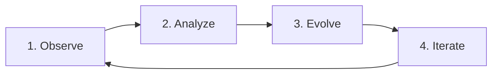

## What is the Evolution Pipeline?

The evolution pipeline is Darwin's core innovation: a complete cycle that observes user behavior, analyzes patterns, and automatically generates code improvements.



<CardGroup cols={2}>
  <Card title="👁️ Observe" icon="eye">
    Browser agent executes tasks while capturing thoughts and analytics
  </Card>
  <Card title="🧠 Analyze" icon="chart-line">
    AI identifies UX problems from behavioral patterns
  </Card>
  <Card title="🧬 Evolve" icon="code">
    AI generates code changes to fix problems
  </Card>
  <Card title="🔄 Iterate" icon="rotate">
    Repeat the cycle to continuously improve
  </Card>
</CardGroup>

## Step 1: Observe

### Browser Agent Execution

The pipeline starts by running a browser agent:

```bash
npx darwin run --website "https://your-app.com" --task "Complete the signup flow"
```

During execution, Darwin captures:

<Tabs>
  <Tab title="Thoughts">
    **Agent's reasoning at every step**

    ```typescript
    interface ThoughtEntry {
      step: number;
      text: string;
      timestamp: string;
      source: 'stream' | 'step_finish' | 'tool_result';
    }
    ```

    Example thoughts:
    - "I see a sign-up button but it's small and hard to notice"
    - "The email field doesn't show validation errors clearly"
    - "I expected the password requirements to be visible before typing"
  </Tab>

  <Tab title="Analytics Events">
    **User interactions and behaviors**

    Your app should track events like:
    ```typescript
    {
      event: 'button_click',
      session_id: 'abc123',
      user_id: 'user_456',
      timestamp: 1234567890,
      properties: {
        button_text: 'Sign Up',
        page_name: '/signup'
      }
    }
    ```

    Common event types:
    - `session_started`
    - `page_view`
    - `button_click`
    - `form_submit`
    - `error_shown`
    - `session_ended`
  </Tab>
</Tabs>

### Data Storage

Analytics are typically stored in `events.json`:

```json
[
  {
    "event": "session_started",
    "session_id": "sess_123",
    "timestamp": 1234567890,
    "task": "Complete signup"
  },
  {
    "event": "button_click",
    "session_id": "sess_123",
    "button_text": "Sign Up",
    "page_name": "/"
  }
]
```

<Note>
The demo app (`packages/demo-app`) includes a complete analytics implementation you can reference.
</Note>

## Step 2: Analyze

### AI-Powered Analysis

The `Analyst` class uses Google Gemini to analyze the data:

```typescript
const analyst = new Analyst(targetAppPath);
const analysis = await analyst.analyze(analyticsSnapshot, thoughts);
```

### Analysis Prompt

The analyst receives:

1. **Analytics snapshot**: All tracked events
2. **Thought entries**: Agent's reasoning

And is instructed to:

```
You are a senior product analyst and growth engineer.

Your task:
- Analyze product analytics and user thoughts
- Identify the MOST impactful user experience problems
- Base conclusions ONLY on provided data
- Output STRICT JSON matching the schema
- Be concise, evidence-driven, and actionable
```

### Analysis Output

```typescript
interface AnalysisResult {
  summary: string;
  mainProblems: Array<{
    id: string;
    severity: "low" | "medium" | "high" | "critical";
    evidence: string[];
    hypothesis: string;
    recommendedAction: string;
    affectedArea: string;
  }>;
  confidence: number;
}
```

### Example Analysis

```json
{
  "summary": "Users struggle to find and complete the sign-up process",
  "mainProblems": [
    {
      "id": "signup-button-visibility",
      "severity": "high",
      "evidence": [
        "Agent thought: 'Sign up button is small and hard to notice'",
        "No button_click events for 15 seconds after page load",
        "Agent had to scroll to find the button"
      ],
      "hypothesis": "The sign-up CTA lacks visual prominence",
      "recommendedAction": "Increase button size, use contrasting color, add icon",
      "affectedArea": "Homepage hero section"
    }
  ],
  "confidence": 0.85
}
```

## Step 3: Evolve

### Code Generation

The analyst uses an AI coding agent (Claude via `runClaude()`) to fix the problems:

```typescript
const evolutionResult = await analyst.evolve(analysis);
```

### UX Agent Prompt

The AI agent receives:

```
You are an autonomous UX/UI improvement agent.

ROLE:
- Specialize in improving user experience and interface clarity
- Make minimal, high-impact code changes
- Prioritize accessibility, visual hierarchy, and usability

CRITICAL INSTRUCTION:
- Address ONLY ONE issue in this task
- Make ONLY ONE change to fix the single issue below

CONTEXT:
Issue: signup-button-visibility
Severity: high
Affected Area: Homepage hero section
Hypothesis: The sign-up CTA lacks visual prominence
Evidence:
  - Agent thought: 'Sign up button is small and hard to notice'
  - No button_click events for 15 seconds after page load
Recommended Action:
  Increase button size, use contrasting color, add icon

TASK:
- Modify ONLY the relevant file(s)
- Keep changes minimal and focused
- Do NOT refactor unrelated code
```

### Generated Changes

The AI modifies your codebase directly and outputs:

```json
{
  "changes": [
    {
      "id": "signup-cta-enhancement",
      "component": "HeroSection",
      "description": "Increased sign-up button size and prominence",
      "type": "modified",
      "file": "app/components/HeroSection.tsx",
      "explanation": "This addresses the low click-through rate by making the CTA more visible with larger size (text-xl), stronger color contrast (bg-purple-600), and an icon for visual interest."
    }
  ]
}
```

## Step 4: Iterate

After code changes are applied:

1. **Test the changes** - Run the app and verify improvements
2. **Run the agent again** - Observe if the issue is resolved
3. **Repeat the cycle** - Continue until UX is optimized

```bash
# Iteration 1
npm run evolve
# Review changes, test app

# Iteration 2
npm run evolve
# More refinements

# Iteration N
# App reaches optimal UX
```

## Running the Full Pipeline

### CLI Command

```bash
npx darwin evolve
```

This runs all four steps automatically:

<Steps>
  <Step title="Clear previous events">
    Empties `events.json` to start fresh
  </Step>

  <Step title="Run browser agent">
    Executes the task and captures thoughts
  </Step>

  <Step title="Load analytics">
    Reads events from `events.json`
  </Step>

  <Step title="Analyze with Gemini">
    Identifies UX problems
  </Step>

  <Step title="Evolve with Claude">
    Generates code changes
  </Step>
</Steps>

### API Endpoint

Via HTTP:

```bash
curl -X POST http://localhost:3002/api/evolve \
  -H "Content-Type: application/json" \
  -d '{
    "website": "https://your-app.com",
    "task": "Complete signup flow",
    "targetAppPath": "./packages/demo-app"
  }'
```

Returns:

```json
{
  "sessionId": "sess_abc123",
  "status": "started",
  "message": "Evolution pipeline started"
}
```

Then stream progress:

```bash
curl http://localhost:3002/api/stream/sess_abc123
```

### Programmatic Usage

```typescript
import { BrowserAgent } from "./core/browser-agent";
import { Analyst } from "./core/analyst";
import { AnalyticsSnapshot } from "./helpers/analytic-types";
import * as fs from "fs";

// Step 1: Run agent
const agent = new BrowserAgent({
  website: "https://your-app.com",
  task: "Complete signup flow",
  model: "google/gemini-3-flash-preview",
  maxSteps: 20
});

await agent.init();
const { thoughts } = await agent.execute();
await agent.close();

// Step 2: Load analytics
const events = JSON.parse(
  fs.readFileSync("./events.json", "utf-8")
);
const analyticsSnapshot: AnalyticsSnapshot = { events };

// Step 3: Analyze
const analyst = new Analyst("./path/to/app");
const analysis = await analyst.analyze(analyticsSnapshot, thoughts);

console.log(`Found ${analysis.mainProblems.length} issues`);
analysis.mainProblems.forEach(p => {
  console.log(`[${p.severity}] ${p.hypothesis}`);
});

// Step 4: Evolve
const evolutionResult = await analyst.evolve(analysis);

console.log("Changes:", evolutionResult.changes);
```

## Configuration

### Target App Path

Specify where your app code lives:

```bash
npx darwin evolve --target ../my-app
```

Or in `darwin.config.json`:

```json
{
  "website": "http://localhost:3000",
  "task": "Test the user flow",
  "targetAppPath": "../my-app"
}
```

### Model Selection

<Info>
The pipeline uses **two different models**: Gemini for analysis, Claude for code generation.
</Info>

**Why different models?**

- **Gemini** excels at analytical reasoning
- **Claude** (via Anthropic's coding agent) excels at code generation

## Monitoring Progress

### Terminal Output

```bash
🧬 Darwin Evolution Pipeline

  Website: http://localhost:3000
  Task: Complete signup flow
  Target: /path/to/demo-app

Clearing previous events...
✓ Events cleared

Step 1: Running browser agent...
💭 Thinking: Looking for sign up button...
🔧 Action: click
✓ Agent completed with 12 thoughts

Step 2: Loading analytics events...
✓ Loaded 45 events

Step 3: Analyzing data with Gemini...
✓ Analysis complete: 2 issues found
  Summary: Users struggle with form visibility

  Issues found:
    1. [high] Homepage hero section: CTA lacks prominence
    2. [medium] Sign-up form: Password requirements unclear

Step 4: Evolving codebase with Gemini...
[Claude output streams here]

✓ Evolution complete!
✓ Parsed 1 change from output
```

### Dashboard View

The Darwin dashboard shows:

- Session status and progress
- Streaming logs in real-time
- Generated changes
- Before/after comparisons

Access at `http://localhost:3001` after starting services:

```bash
npm run start:services
```

## Best Practices

<CardGroup cols={2}>
  <Card title="Clear Events" icon="broom">
    Always clear `events.json` before a fresh run to avoid mixing sessions
  </Card>
  <Card title="Specific Tasks" icon="bullseye">
    Use concrete, specific task descriptions for better analysis
  </Card>
  <Card title="Iterative Fixes" icon="rotate">
    Run multiple cycles - each iteration improves the UX further
  </Card>
  <Card title="Review Changes" icon="eye">
    Always review AI-generated code before deploying
  </Card>
</CardGroup>

### Task Writing Tips

<Tip>
**Good task**: "Sign up for an account using test@example.com, then complete the onboarding flow"

**Bad task**: "Use the app"
</Tip>

## Limitations

<Warning>
The evolution pipeline is **experimental**. Always review generated code changes before deploying.
</Warning>

- **Single issue focus**: Only fixes one problem per run (by design)
- **Code quality**: AI-generated code may need refinement
- **Context limits**: Large codebases may exceed model context
- **Breaking changes**: AI might inadvertently break functionality

## Next Steps

<CardGroup cols={2}>
  <Card title="Analytics Tracking" icon="chart-line" href="/concepts/analytics-tracking">
    Learn how to implement analytics in your app
  </Card>
  <Card title="Dashboard" icon="desktop" href="/guides/dashboard">
    Monitor evolution sessions visually
  </Card>
  <Card title="CLI Reference" icon="terminal" href="/cli/evolve">
    Full `darwin evolve` command reference
  </Card>
  <Card title="Examples" icon="lightbulb" href="/examples/ui-evolution">
    See real evolution examples
  </Card>
</CardGroup>