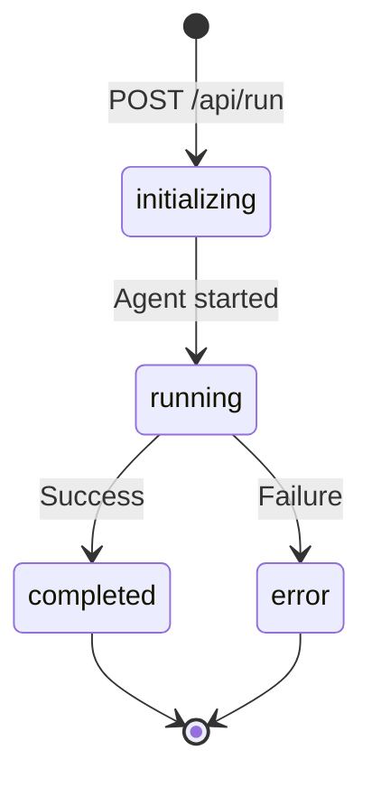

## Overview

Darwin includes an Express-based API server that provides HTTP endpoints for running agents, managing sessions, and streaming results.

<Info>
The API server is perfect for integrating Darwin into existing applications, building dashboards, or running automation as a service.
</Info>

## Starting the Server

### Standalone

From the `darwin-sdk` package:

```bash
cd packages/darwin-sdk
npm run start:dev
```

The server starts on **port 3002** by default.

### With Dashboard

From the root directory:

```bash
npm run start:services
```

This starts:
- **Express API** on port 3002
- **Dashboard UI** on port 3001

### Programmatically

```typescript
import { startDarwin } from "darwin-ui/core/main";

startDarwin();
// Server listening on port 3002
```

## API Reference

### Health Check

**GET** `/api/status`

Check if the API is running.

**Response**:

```json
{
  "status": "ready",
  "service": "Darwin Browser Agent API"
}
```

**Example**:

```bash
curl http://localhost:3002/api/status
```

---

### Get Configuration

**GET** `/api/config`

Retrieve the current `darwin.config.json` configuration.

**Response**:

```json
{
  "website": "https://example.com",
  "task": "Complete signup flow",
  "model": "google/gemini-3-flash-preview",
  "maxSteps": 20,
  "env": "LOCAL",
  "verbose": 1
}
```

**Error Response** (404):

```json
{
  "error": "Config file not found: darwin.config.json"
}
```

**Example**:

```bash
curl http://localhost:3002/api/config
```

---

### Run Agent (Async)

**POST** `/api/run`

Start a browser agent task asynchronously and return immediately.

**Request Body**:

```json
{
  "website": "https://example.com",
  "task": "Find the pricing page",
  "model": "google/gemini-3-flash-preview",
  "maxSteps": 20,
  "env": "LOCAL",
  "systemPrompt": "Optional custom prompt"
}
```

**Response**:

```json
{
  "sessionId": "sess_abc123xyz",
  "status": "started",
  "message": "Browser agent task started",
  "config": {
    "website": "https://example.com",
    "task": "Find the pricing page"
  }
}
```

**Example**:

```bash
curl -X POST http://localhost:3002/api/run \
  -H "Content-Type: application/json" \
  -d '{
    "website": "https://example.com",
    "task": "Click the sign up button",
    "maxSteps": 10
  }'
```

<Note>
Use the returned `sessionId` to stream logs or check status.
</Note>

---

### Run Agent (Sync)

**POST** `/api/run-sync`

Run a browser agent task and wait for completion.

**Request Body**:

Same as `/api/run`

**Response**:

```json
{
  "status": "completed",
  "success": true,
  "thoughtCount": 8,
  "thoughts": [
    {
      "step": 1,
      "text": "I see a sign up button in the top right",
      "timestamp": "2026-03-14T10:30:00.000Z",
      "source": "stream"
    }
  ]
}
```

**Example**:

```bash
curl -X POST http://localhost:3002/api/run-sync \
  -H "Content-Type: application/json" \
  -d '{
    "website": "https://example.com",
    "task": "Find contact page",
    "maxSteps": 5
  }'
```

<Warning>
This endpoint blocks until the task completes, which could take minutes. Use `/api/run` for long-running tasks.
</Warning>

---

### Evolution Pipeline

**POST** `/api/evolve`

Run the full evolution pipeline: agent → analyze → evolve.

**Request Body**:

```json
{
  "website": "http://localhost:3000",
  "task": "Complete signup flow",
  "model": "google/gemini-3-flash-preview",
  "maxSteps": 30,
  "targetAppPath": "./packages/demo-app"
}
```

**Response**:

```json
{
  "sessionId": "sess_evolution_xyz",
  "status": "started",
  "message": "Evolution pipeline started",
  "config": {
    "website": "http://localhost:3000",
    "task": "Complete signup flow",
    "targetAppPath": "./packages/demo-app"
  }
}
```

**Example**:

```bash
curl -X POST http://localhost:3002/api/evolve \
  -H "Content-Type: application/json" \
  -d '{
    "website": "http://localhost:3000",
    "task": "Test user registration",
    "targetAppPath": "./my-app"
  }'
```

---

### Get Session

**GET** `/api/session/:sessionId`

Get details about a specific session.

**Response**:

```json
{
  "id": "sess_abc123",
  "status": "completed",
  "config": {
    "website": "https://example.com",
    "task": "Test task",
    "maxSteps": 20
  },
  "steps": 8,
  "maxSteps": 20,
  "result": {
    "success": true,
    "message": "Task completed successfully"
  },
  "createdAt": "2026-03-14T10:30:00.000Z",
  "completedAt": "2026-03-14T10:32:00.000Z",
  "logsCount": 24,
  "isEvolution": false,
  "changes": []
}
```

**Example**:

```bash
curl http://localhost:3002/api/session/sess_abc123
```

---

### Stream Session Logs

**GET** `/api/stream/:sessionId`

Stream session logs in real-time using Server-Sent Events (SSE).

**Response**: Server-Sent Events stream

**Event Types**:

- `status` - Session status changes
- `think` - Agent thoughts
- `action` - Agent actions
- `log` - General logs
- `result` - Final result
- `error` - Errors
- `changes` - Code changes (for evolution sessions)

**Example**:

```javascript
const eventSource = new EventSource('http://localhost:3002/api/stream/sess_abc123');

eventSource.addEventListener('think', (e) => {
  const data = JSON.parse(e.data);
  console.log('💭', data.message);
});

eventSource.addEventListener('action', (e) => {
  const data = JSON.parse(e.data);
  console.log('🔧', data.message);
});

eventSource.addEventListener('result', (e) => {
  const data = JSON.parse(e.data);
  console.log('✅', data.message);
  eventSource.close();
});
```

**cURL Example**:

```bash
curl -N http://localhost:3002/api/stream/sess_abc123
```

---

### List Sessions

**GET** `/api/sessions`

Get all sessions.

**Response**:

```json
[
  {
    "id": "sess_abc123",
    "status": "completed",
    "createdAt": "2026-03-14T10:30:00.000Z",
    "completedAt": "2026-03-14T10:32:00.000Z"
  },
  {
    "id": "sess_xyz789",
    "status": "running",
    "createdAt": "2026-03-14T10:35:00.000Z"
  }
]
```

**Example**:

```bash
curl http://localhost:3002/api/sessions
```

---

### Get Metrics

**GET** `/api/metrics`

Get system metrics.

**Response**:

```json
{
  "totalAgents": 15,
  "agentsTrend": 0,
  "activeSessions": 2,
  "sessionsTrend": 0,
  "successRate": 85,
  "successTrend": 0,
  "tasksCompleted": 12,
  "tasksTrend": 0
}
```

**Example**:

```bash
curl http://localhost:3002/api/metrics
```

## Session Management

### Session Lifecycle



### Session Statuses

| Status | Description |
|--------|-------------|
| `initializing` | Session created, agent starting |
| `running` | Agent executing task |
| `completed` | Task finished successfully |
| `error` | Task failed |

## CORS

The API server has CORS enabled for all origins:

```typescript
import cors from "cors";
app.use(cors());
```

This allows frontend applications to call the API from any domain.

## Integration Examples

### React Hook

```typescript
import { useState, useEffect } from 'react';

function useAgent(website: string, task: string) {
  const [sessionId, setSessionId] = useState<string | null>(null);
  const [status, setStatus] = useState<string>('idle');
  const [thoughts, setThoughts] = useState<any[]>([]);
  const [result, setResult] = useState<any>(null);

  const startAgent = async () => {
    const response = await fetch('http://localhost:3002/api/run', {
      method: 'POST',
      headers: { 'Content-Type': 'application/json' },
      body: JSON.stringify({ website, task })
    });
    const data = await response.json();
    setSessionId(data.sessionId);
    setStatus('started');
  };

  useEffect(() => {
    if (!sessionId) return;

    const eventSource = new EventSource(
      `http://localhost:3002/api/stream/${sessionId}`
    );

    eventSource.addEventListener('think', (e) => {
      const data = JSON.parse(e.data);
      setThoughts(prev => [...prev, data]);
    });

    eventSource.addEventListener('status', (e) => {
      const data = JSON.parse(e.data);
      setStatus(data.status);
    });

    eventSource.addEventListener('result', (e) => {
      const data = JSON.parse(e.data);
      setResult(data);
      setStatus('completed');
      eventSource.close();
    });

    return () => eventSource.close();
  }, [sessionId]);

  return { startAgent, status, thoughts, result };
}

// Usage
function MyComponent() {
  const { startAgent, status, thoughts } = useAgent(
    'https://example.com',
    'Find pricing'
  );

  return (
    <div>
      <button onClick={startAgent}>Start Agent</button>
      <p>Status: {status}</p>
      <ul>
        {thoughts.map((t, i) => (
          <li key={i}>{t.message}</li>
        ))}
      </ul>
    </div>
  );
}
```

### Python Client

```python
import requests
import json

# Start agent
response = requests.post('http://localhost:3002/api/run', json={
    'website': 'https://example.com',
    'task': 'Find the contact page',
    'maxSteps': 10
})

session_id = response.json()['sessionId']
print(f"Session started: {session_id}")

# Poll for status
import time
while True:
    response = requests.get(f'http://localhost:3002/api/session/{session_id}')
    session = response.json()
    
    print(f"Status: {session['status']}")
    
    if session['status'] in ['completed', 'error']:
        print(f"Result: {session.get('result')}")
        break
    
    time.sleep(2)
```

### Webhook Integration

Extend the API to send webhooks on completion:

```typescript
// In core/main.ts
app.post("/api/run", async (req, res) => {
  const { website, task, webhookUrl } = req.body;
  
  // ... create session ...
  
  agent.execute()
    .then(async (result) => {
      // Send webhook
      if (webhookUrl) {
        await fetch(webhookUrl, {
          method: 'POST',
          headers: { 'Content-Type': 'application/json' },
          body: JSON.stringify({
            sessionId,
            status: 'completed',
            result
          })
        });
      }
    });
    
  res.json({ sessionId, status: 'started' });
});
```

## Deployment

### Docker

```dockerfile
FROM node:20-alpine

WORKDIR /app

COPY package*.json ./
RUN npm install

COPY . .
RUN npm run build

EXPOSE 3002

CMD ["node", "dist/core/start-server.js"]
```

```bash
docker build -t darwin-api .
docker run -p 3002:3002 -e GOOGLE_GENERATIVE_AI_API_KEY=xxx darwin-api
```

### Environment Variables

```bash
PORT=3002
GOOGLE_GENERATIVE_AI_API_KEY=your_key
ANTHROPIC_API_KEY=your_key
OPENAI_API_KEY=your_key
BROWSERBASE_API_KEY=your_key
BROWSERBASE_PROJECT_ID=your_id
```

## Next Steps

<CardGroup cols={2}>
  <Card title="Dashboard" icon="desktop" href="/guides/dashboard">
    Use the visual dashboard UI
  </Card>
  <Card title="Programmatic Usage" icon="code" href="/guides/programmatic-usage">
    Use Darwin classes directly
  </Card>
  <Card title="API Reference" icon="book" href="/api/endpoints/run">
    Detailed endpoint documentation
  </Card>
  <Card title="Examples" icon="lightbulb" href="/examples/custom-workflows">
    See integration examples
  </Card>
</CardGroup>